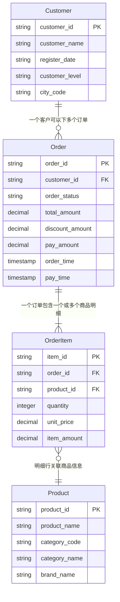
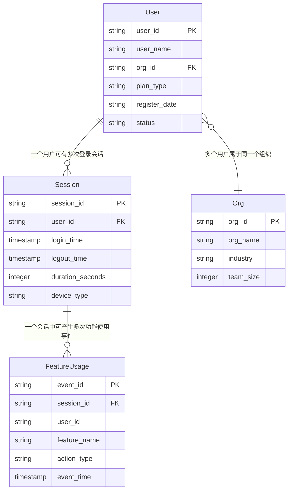
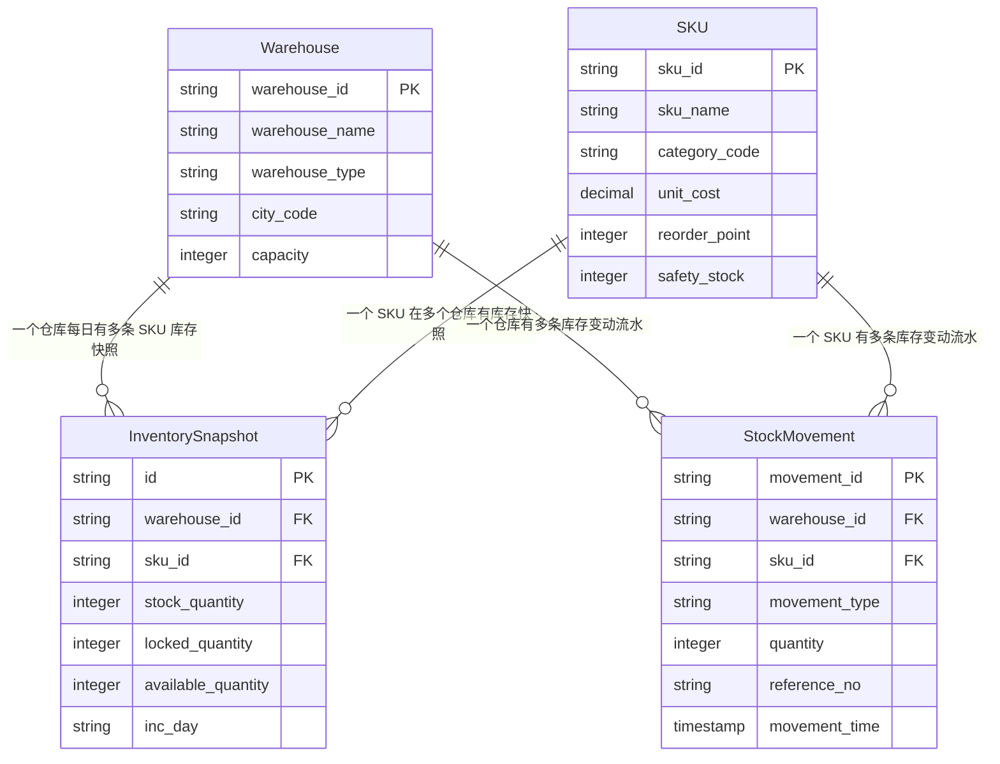

# Aqueduct 可视化知识库（本体模型）

> **说明**: 本文档由 `knowledge/domains/*.json` 聚合生成。**JSON 用于 AI 执行，本 MD 用于人工审计。**

---

## 目录

- [电商订单分析](#业务域电商订单分析)
- [SaaS 用户活跃分析](#业务域saas-用户活跃分析)
- [供应链库存分析](#业务域供应链库存分析)

---

## 业务域：电商订单分析

- **ID**: `ecommerce_order`
- **描述**: 示例业务域：电商平台订单全链路分析，覆盖下单、支付、发货、签收等核心环节
- **版本**: 1.0.0

### 1. 关系拓扑图 (Relationship Map)

### 2. 核心实体 (Entities)

| 实体名 | 主键 | 属性数 | 物理来源 | 描述 |
| :--- | :--- | :--- | :--- | :--- |
| Customer | `customer_id` | 5 | `dw_demo.dim_customer_info_df` | 客户实体，包含基本信息和会员等级 |
| Order | `order_id` | 9 | `dw_demo.dwd_order_info_di` | 订单主实体，记录订单全生命周期状态 |
| OrderItem | `item_id` | 6 | `dw_demo.dwd_order_item_di` | 订单明细行，一个订单可包含多个商品明细 |
| Product | `product_id` | 5 | `dw_demo.dim_product_info_df` | 商品维度实体 |

### 3. 层级分类 (Hierarchy)

**OrderStatus**

- **PendingPayment**: 待支付
  - 规则: `order_status = '10'`
- **Paid**: 已支付
  - 规则: `order_status = '20'`
- **Shipped**: 已发货
  - 规则: `order_status = '30'`
- **Completed**: 已签收
  - 规则: `order_status = '40'`
- **Cancelled**: 已取消
  - 规则: `order_status = '50'`

### 4. 指标口径 (Metrics)

| 指标名称 | 定义 | 计算式 | 过滤条件 | 单位 | 预警阈值 |
| :--- | :--- | :--- | :--- | :--- | :--- |
| 成交总额 (GMV) | 已支付订单的实付金额总和 | `SUM(pay_amount)` | `order_status IN ('20','30','40')` | 元 | - |
| 订单数 | 当日创建的订单总数 | `COUNT(DISTINCT order_id)` | - | 单 | - |
| 支付转化率 | 已支付订单数 / 总下单数 | `COUNT(CASE WHEN order_status >= '20' THEN 1 END) * 100.0 / COUNT(DISTINCT order_id)` | - | % | 低于 70% 需预警 |
| 客单价 | GMV / 已支付订单数 | `SUM(pay_amount) / NULLIF(COUNT(CASE WHEN order_status >= '20' THEN 1 END), 0)` | - | 元/单 | - |

### 5. 领域公理 (Axioms)

| 编号 | 公理描述 | 形式化表达 |
| :--- | :--- | :--- |
| AX-001 | 每个订单明细必然关联且仅关联一个订单 | `forall i in OrderItem, exists! o in Order: i.order_id = o.order_id` |
| AX-002 | 订单金额守恒：订单总金额等于明细金额之和 | `forall o in Order: o.total_amount = SUM(i.item_amount)` |
| AX-003 | 实付金额非负 | `forall o in Order: o.pay_amount >= 0` |

### 6. 业务规则 (Business Rules)

| 规则名 | 内容 |
| :--- | :--- |
| GMV 口径 | 仅统计已支付及以上状态（order_status >= '20'）的订单，待支付和已取消不计入 |
| 金额校验 | pay_amount = total_amount - discount_amount，误差超过 0.01 元需标记异常 |
| 明细金额校验 | item_amount = quantity * unit_price，不一致则标记为数据质量问题 |

### 7. 分区与过滤规则 (Filter Rules)

| 规则名 | 说明 | 条件 |
| :--- | :--- | :--- |
| order_partition | 订单表取 T-1 日分区 | `inc_day = '$[time(yyyyMMdd,-1d)]'` |
| valid_order | 有效订单：排除已取消 | `order_status != '50'` |

---

## 业务域：SaaS 用户活跃分析

- **ID**: `saas_user_activity`
- **描述**: 示例业务域：SaaS 产品用户活跃度分析，覆盖 DAU/MAU、留存率、功能渗透率等核心指标
- **版本**: 1.0.0

### 1. 关系拓扑图 (Relationship Map)

### 2. 核心实体 (Entities)

| 实体名 | 主键 | 属性数 | 物理来源 | 描述 |
| :--- | :--- | :--- | :--- | :--- |
| User | `user_id` | 6 | `dw_demo.dim_user_info_df` | 用户实体，包含订阅计划和账号状态 |
| Session | `session_id` | 7 | `dw_demo.dwd_user_session_di` | 用户登录会话实体 |
| FeatureUsage | `event_id` | 8 | `dw_demo.dwd_feature_usage_di` | 功能使用事件 |
| Org | `org_id` | 4 | `dw_demo.dim_org_info_df` | 组织实体 |

### 3. 指标口径 (Metrics)

| 指标名称 | 定义 | 计算式 | 过滤条件 | 单位 | 预警阈值 |
| :--- | :--- | :--- | :--- | :--- | :--- |
| 日活跃用户数 (DAU) | 当日有登录会话的去重用户数 | `COUNT(DISTINCT user_id)` | T-1 日 | 人 | - |
| 月活跃用户数 (MAU) | 近 30 天有登录的去重用户数 | `COUNT(DISTINCT user_id)` | 近 30 天 | 人 | - |
| 平均会话时长 | 当日登录会话的平均时长 | `AVG(duration_seconds)` | `duration_seconds > 0` | 秒 | - |
| 功能渗透率 | 使用过指定功能的用户数 / DAU | `COUNT(DISTINCT ...) * 100.0 / NULLIF(DAU, 0)` | - | % | 核心功能低于 30% 需关注 |

### 4. 领域公理 (Axioms)

| 编号 | 公理描述 | 形式化表达 |
| :--- | :--- | :--- |
| AX-001 | 每个功能使用事件必然关联且仅关联一个会话 | `forall f in FeatureUsage, exists! s in Session: f.session_id = s.session_id` |
| AX-002 | 会话时长非负 | `forall s in Session: s.duration_seconds >= 0` |
| AX-003 | DAU 是 MAU 的子集 | `forall u: DAU(u, day) -> MAU(u, month_of(day))` |

### 5. 业务规则 (Business Rules)

| 规则名 | 内容 |
| :--- | :--- |
| 活跃定义 | 用户当日至少有一条 Session 记录即视为活跃 |
| 流失定义 | 连续 30 天无 Session 记录的用户标记为 churned |
| 会话时长上限 | duration_seconds 超过 86400（24 小时）视为异常 |

### 6. 分区与过滤规则 (Filter Rules)

| 规则名 | 说明 | 条件 |
| :--- | :--- | :--- |
| session_partition | 会话表取 T-1 日分区 | `inc_day = '$[time(yyyyMMdd,-1d)]'` |
| active_user | 有效用户：排除已停用和已流失 | `status = 'active'` |

---

## 业务域：供应链库存分析

- **ID**: `supply_chain_inventory`
- **描述**: 示例业务域：供应链库存周转与补货分析，覆盖库存水位、周转天数、缺货预警等核心场景
- **版本**: 1.0.0

### 1. 关系拓扑图 (Relationship Map)

### 2. 核心实体 (Entities)

| 实体名 | 主键 | 属性数 | 物理来源 | 描述 |
| :--- | :--- | :--- | :--- | :--- |
| Warehouse | `warehouse_id` | 5 | `dw_demo.dim_warehouse_info_df` | 仓库实体 |
| SKU | `sku_id` | 6 | `dw_demo.dim_sku_info_df` | SKU 维度实体 |
| InventorySnapshot | `id` | 7 | `dw_demo.dwd_inventory_snapshot_di` | 每日库存快照 |
| StockMovement | `movement_id` | 8 | `dw_demo.dwd_stock_movement_di` | 库存变动流水 |

### 3. 指标口径 (Metrics)

| 指标名称 | 定义 | 计算式 | 单位 | 预警阈值 |
| :--- | :--- | :--- | :--- | :--- |
| 库存总价值 | 所有仓库所有 SKU 库存数量 * 单位成本之和 | `SUM(stock_quantity * unit_cost)` | 元 | - |
| 缺货 SKU 数 | 可用库存低于安全库存的 SKU 数量 | `COUNT(DISTINCT CASE WHEN available_quantity < safety_stock THEN sku_id END)` | 个 | 超过 50 个需紧急补货 |
| 库存周转天数 | 平均库存数量 / 日均出库数量 | `AVG(stock_quantity) / NULLIF(AVG(outbound), 0)` | 天 | 超过 60 天为滞销 |
| 补货预警 SKU 数 | 可用库存低于补货触发点的 SKU 数量 | `COUNT(DISTINCT CASE WHEN available_quantity < reorder_point THEN sku_id END)` | 个 | - |

### 4. 领域公理 (Axioms)

| 编号 | 公理描述 | 形式化表达 |
| :--- | :--- | :--- |
| AX-001 | 每个仓库+SKU 组合每日有且仅有一条库存快照 | `forall w,s,d: exists! snap: snap.warehouse_id=w AND snap.sku_id=s AND snap.inc_day=d` |
| AX-002 | 可用库存等于库存数量减去锁定数量 | `forall snap: snap.available_quantity = snap.stock_quantity - snap.locked_quantity` |
| AX-003 | 库存数量非负 | `forall snap: snap.stock_quantity >= 0 AND snap.locked_quantity >= 0` |

### 5. 业务规则 (Business Rules)

| 规则名 | 内容 |
| :--- | :--- |
| 可用库存计算 | available_quantity = stock_quantity - locked_quantity，不可为负数 |
| 缺货判定 | available_quantity < safety_stock 即为缺货，需触发补货预警 |
| 周转天数异常 | 库存周转天数超过 60 天视为滞销 |
| 盘点调整约束 | adjustment 类型的变动需有审批单号，否则视为异常流水 |

### 6. 分区与过滤规则 (Filter Rules)

| 规则名 | 说明 | 条件 |
| :--- | :--- | :--- |
| snapshot_partition | 库存快照取 T-1 日分区 | `inc_day = '$[time(yyyyMMdd,-1d)]'` |
| movement_partition | 库存流水取 T-1 日分区 | `inc_day = '$[time(yyyyMMdd,-1d)]'` |
| active_sku | 只分析在售 SKU | `status = 'active'` |

---
