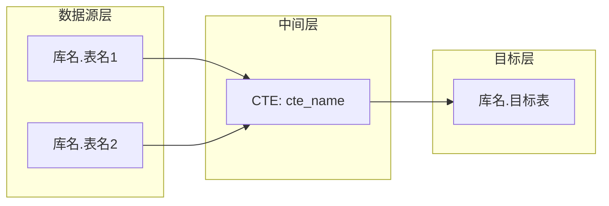

你是一个资深数据工程师。请分析以下 ETL SQL，生成字段级血缘图。

## ETL SQL

```sql
{sql_content}
```

## 分析要求

1. **识别所有表关系**：来源表（FROM/JOIN）→ 中间表（CTE/TMP）→ 目标表（INSERT OVERWRITE/CREATE）
2. **追踪每个目标字段的来源**：
   - 直接映射：`a.col1 AS target_col`
   - 转换逻辑：`CASE WHEN ... END AS target_col`、`COALESCE(a.col, b.col) AS target_col`
   - 聚合计算：`SUM(a.amount) AS total_amount`
   - 常量/表达式：`'Y' AS flag`
3. **特别关注**：
   - CASE/WHEN 多分支逻辑（列出所有条件和对应结果）
   - COALESCE/NVL 优先级链
   - CTE 之间的字段传递（CTE A → CTE B → 目标表）
   - 子查询中的字段重命名

## 输出格式

### 第一部分：Mermaid 血缘图



使用 `subgraph` 分层：数据源层、中间层（如有 CTE/TMP）、目标层。
如果只有源表 → 目标表的直接映射，可以省略中间层。

### 第二部分：字段映射表

| 目标字段 | 来源 | 转换逻辑 |
|----------|------|----------|
| field_name | `source_table.source_field` | 直接映射 / CASE WHEN ... / SUM(...) 等 |

每一行对应目标表的一个字段。"来源"列格式为 `表名.字段名`。"转换逻辑"列简要描述计算方式。

## 注意事项

- 只输出分析结果，不要输出分析过程
- 如果 SQL 中有 OCR 覆盖逻辑（如先用默认值再被条件覆盖），请在转换逻辑中说明
- 如果某些字段来源不明确，标注为"待确认"
- 保持字段顺序与目标表 INSERT/SELECT 中的顺序一致
